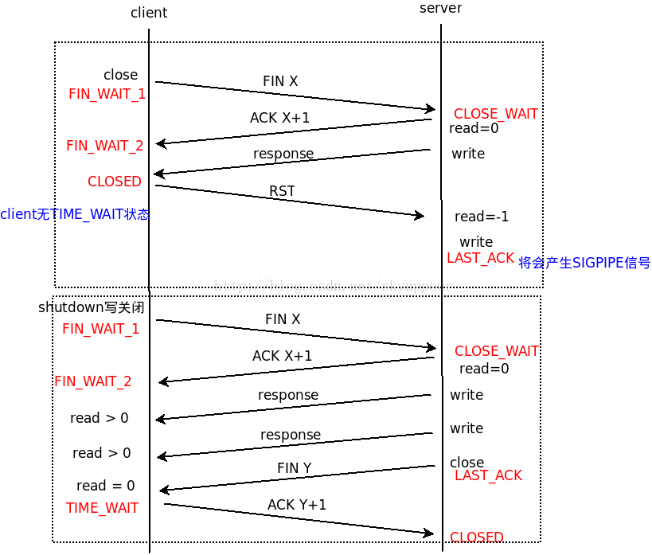
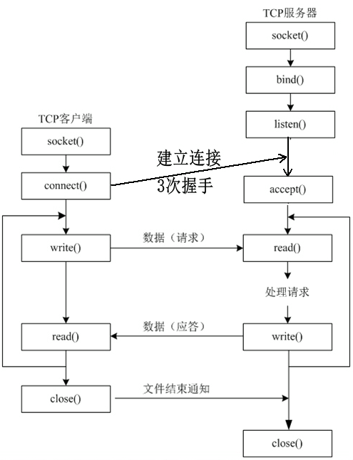

# 基础知识

- Reactor反应模型

  第一版的服务器用的只是一个简单的Reactor模型。主线程包含一个I/O多路转接器负责处理请求事件，对I/O的处理交给工作线程。

- TCP建立与关闭连接的过程，及优雅关闭连接

  [TCP建立连接的三次握手和断开连接的四次挥手](https://www.cnblogs.com/LCCRNblog/p/5228648.html)

  [TCP半关闭shutdown()函数](https://blog.csdn.net/skyuppour/article/details/44459579)

  着重说一下关闭连接的问题

  - 发送方不安全关闭连接方式：数据发送完后，直接调用close()

    直接调用close()函数会关闭整个TCP连接，**如果TCP的发送缓冲区中还有数据，就会丢失**（**虽然也会发送出去，但是对方会返回一个RST或者SIGPIEP信号**），所以发送方发送数据完成后，直接用close()，可能会导致接收方接收的数据不完整。

  - 发送方安全关闭连接的方式：数据发送完后，调用shutdown(sockfd, SHUT_WR)函数，关闭TCP的写端

    发送方关闭TCP连接的**写端**（**这样任何对Socket写操作会触发SIGPIPE信号,同时发送FIN字段**），这样会使接收方的read返回0，如果接收方没有其他事做（有其他事：**若TCP发送缓冲区中还有数据没发完，会等到发送完毕再关闭连接**），接收方就会关闭连接（**发送FIN字段**），接收方关闭连接后，发送方的read也会返回0，发送方会进入**TIME_WAIT**状态，这样就是完整的通信，就不会出现数据丢失的情况了
  
  - 接收方安全关闭连接的方式：read()->0后，再调用close()
  
  - 
  
- TCP C/S编程三部曲

  设置端口复用SO_REUSEADDR

  忽略SIGPIPE信号

  设置TCP_NODELAY

- 忽略SIGPIPE信号

  在UNIX中，当发送方向一个已经关闭的管道写数据，发送方会收到SIGPIPE信号，默认情况会导致进程终止，这种情况有利于命令行管道，但是却不利于网络通信。在网络编程中，服务器向已关闭连接的客户端发送数据就会触发SIGPIPE信号，进而导致整个服务进程终止，影响所有的客户端。所以，在服务器启动之前需要忽略SIGPIPE信号。

  > void handle_for_sigpipe()
  > {
  >     struct sigaction sa;
  >     memset(&sa, '\0', sizeof(sa));
  >     sa.sa_handler = SIG_IGN;
  >     sa.sa_flags = 0;
  >     if(sigaction(SIGPIPE, &sa, NULL))
  >         return;
  > }

- 设置TCP_NODELAY

  默认情况下，TCP连接中，只要存在，已发送的数据包没有收到ACK的情况，调用write()不会发送数据，而是阻塞等待接收到所有已发数据包的ACK后再发送，所以对于write()->write()->read()方式，第二次的write()会有一个RTT（Round-Trip-time）的时延，虽说可以通过发送方的缓冲机制（将发送的消息整合到一起，只发送一次----write()->read()机制）解决，但并发请求下，缓冲机制的实现很难，所以，一般都会把TCP时延选项关掉。

  > int optval=1;
  >
  > ::setsockopt(sockfd_, IPPROTO_TCP, TCP_NODELAY, &optval, static_cast<socklen_t>(sizeof optval)) ;

- 设置端口复用SO_REUSEADDR

  方便服务器崩溃后可以马上重启，而不是要等待2分钟左右，等待端口重新启用。

  在fork per connection模型中，子进程和父进程共享文件描述符（端口号），必须设置端口复用

  > int optval=1;
  >
  > ::setsockopt(sockfd_, SOL_SOCKET, SO_REUSEADDR,&optval, sizeof optval);

- TCP建立连接三次握手是从accept()函数之后开始的吗？

  [TCP网络编程中connect()、listen()和accept()三者之间的关系](https://blog.csdn.net/tennysonsky/article/details/45621341?depth_1-utm_source=distribute.pc_relevant.none-task&utm_source=distribute.pc_relevant.none-task)

  不是的。在客户端调用connect()后，三次握手建立连接开始。accept()只是从处于 established 状态的连接队列头部取出一个已经完成的连接，如果这个队列没有已经完成的连接，accept()函数就会阻塞，直到取出队列中已完成的用户连接为止。

  