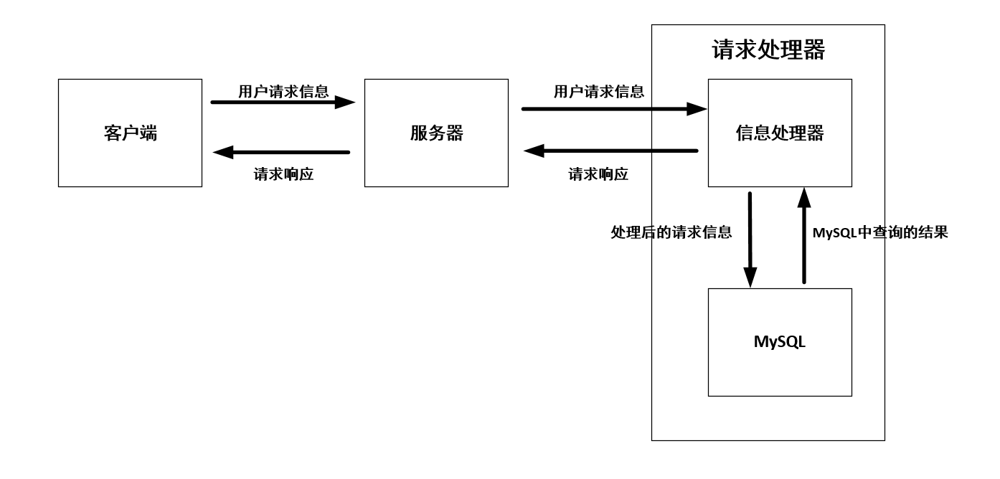

- 整体结构分为三个部分

  - **客户端**：负责与用户交互，根据用户请求生成请求信息，发送给muduo服务器

  - **muduo服务器**：负责从客户端接收用户请求信息，交由请求处理器处理，并从请求处理器接收请求响应，发送给客户端

  - **请求处理器**：分为**信息处理器**和**MySQL**，信息处理器根据用户请求信息的不同，将信息处理后，交由MySQL存储或者从MySQL中获取数据，然后再生成响应信息，交给muduo服务器

    

  